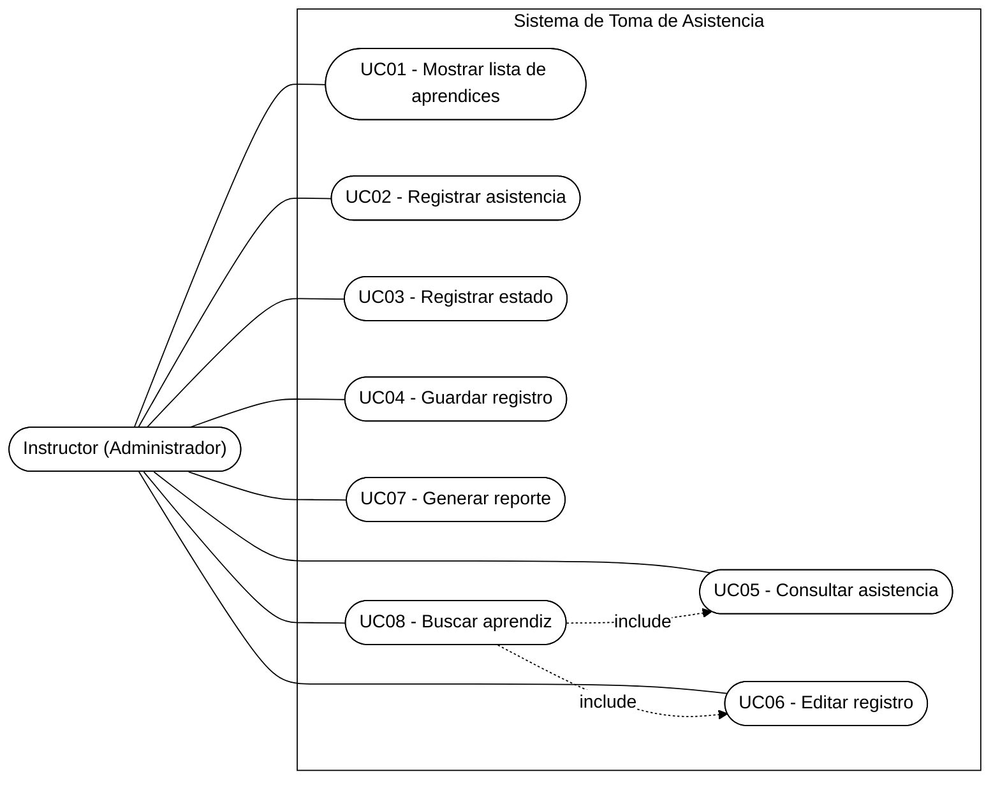
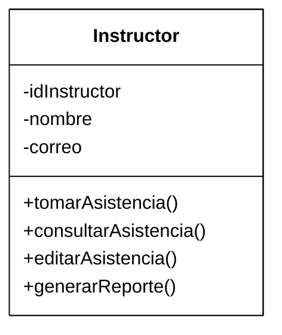

# Sistema de Toma de Asistencia

**Programa de Formación:** Análisis y Desarrollo de Software (ADSO) — Ficha 3413974
**Documento de Especificación de Requisitos** (basado en IEEE 830 - SRS)

---

## 1. Información General del Proyecto

- **Nombre del sistema:** Sistema de Toma de Asistencia.
- **Actor principal:** Instructor (Administrador).
- **Objetivo:** Desarrollar un sistema que permita registrar la asistencia de los aprendices de manera rápida y eficiente, disminuyendo el tiempo empleado por el instructor y facilitando el control, la consulta y la generación de reportes de asistencia.
- **Alcance:** El sistema permitirá al instructor seleccionar una ficha, visualizar el listado de aprendices, registrar la asistencia, consultar y modificar los registros cuando sea necesario, buscar aprendices y generar reportes de asistencia, optimizando el proceso de control y reduciendo el uso de formatos manuales.
- **Descripción:** El proyecto tiene como objetivo optimizar el tiempo de registro de asistencia para la ficha 3413974 del programa de formación ADSO que emplea el instructor. Busca reemplazar el proceso manual por un sistema que permita registrar la asistencia de forma más rápida, organizada y segura.

### Instrumentos de recolección de información

- Observación del proceso actual de cómo se toma la asistencia.
- Revisión del formato utilizado actualmente (SENA Sofia Plus).

---

## 2. Requerimientos Funcionales

| Código | Descripción |
|---|---|
| RF01 | El sistema debe mostrar la lista de los aprendices de la ficha 3413974 del programa de ADSO para realizar el registro. |
| RF02 | El sistema debe permitir registrar la asistencia en una sola pantalla. |
| RF03 | El sistema debe permitir registrar si el aprendiz asistió, llegó tarde o estuvo ausente. |
| RF04 | El sistema debe guardar automáticamente el registro con fecha y hora. |
| RF05 | El sistema debe permitir buscar por asistencia, fecha u hora. |
| RF06 | El sistema debe permitir editar el registro de asistencia cuando sea necesario. |
| RF07 | El sistema debe generar un reporte de asistencia por aprendiz. |
| RF08 | El sistema debe permitir buscar rápidamente un aprendiz en una fecha seleccionada. |

---

## 3. Mockup de Pantallas

Se diseñó un mockup interactivo de baja fidelidad (`mockup_asistencia.html`) para validar el flujo con el instructor antes de programar. Contempla las siguientes 5 pantallas:

1. **Inicio** — inicio de sesión del instructor y selección de la ficha activa (3413974 · ADSO).
2. **Registro de asistencia** — listado de aprendices con opción de marcar Asistió / Tarde / Ausente desde una sola pantalla (RF02, RF03, RF04).
3. **Generación de QR (Versión 2.0)** — código QR dinámico que cambia cada 20 segundos, con sesión de 10 minutos y expiración automática.
4. **Consulta de asistencias** — búsqueda y filtro del historial por aprendiz, fecha u hora, con opción de editar un registro (RF05, RF06, RF08).
5. **Reportes** — indicadores de asistencia, tardanzas y ausencias, con opción de exportar a PDF/Excel planteada como mejora de Versión 2.0 (RF07).

> Ver el mockup interactivo adjunto (`mockup_asistencia.html`) con el diseño visual de estas 5 pantallas.

---

## 4. Modelado UML

### 4.1 Diagrama de Casos de Uso

**Actor:** Instructor (Administrador)

| Caso de uso | Descripción |
|---|---|
| UC01 – Mostrar lista de aprendices | Muestra el listado de aprendices de la ficha 3413974. |
| UC02 – Registrar asistencia | Permite registrar la asistencia desde una sola pantalla. |
| UC03 – Registrar estado | Permite marcar asistió / llegó tarde / ausente. |
| UC04 – Guardar registro | Guarda automáticamente fecha y hora del registro. |
| UC05 – Consultar asistencia | Permite buscar por asistencia, fecha u hora. |
| UC06 – Editar registro | Permite modificar un registro existente. |
| UC07 – Generar reporte | Genera el reporte de asistencia por aprendiz. |
| UC08 – Buscar aprendiz | Permite ubicar rápidamente un aprendiz en una fecha seleccionada. |

*Todos los casos de uso (UC01–UC08) son iniciados por el actor Instructor (Administrador); UC08 se relaciona como apoyo transversal a la consulta y edición de registros.*

### 4.2 Diagrama de Clases (preliminar)

**Clase: Instructor**

| Tipo | Elemento |
|---|---|
| Atributo | - idInstructor |
| Atributo | - nombre |
| Atributo | - correo |
| Método | + tomarAsistencia() |
| Método | + consultarAsistencia() |
| Método | + editarAsistencia() |
| Método | + generarReporte() |

> Nota: este modelo de clases es preliminar; en la siguiente etapa se recomienda incorporar las clases `Aprendiz`, `Ficha` y `Asistencia` con sus respectivas relaciones.

